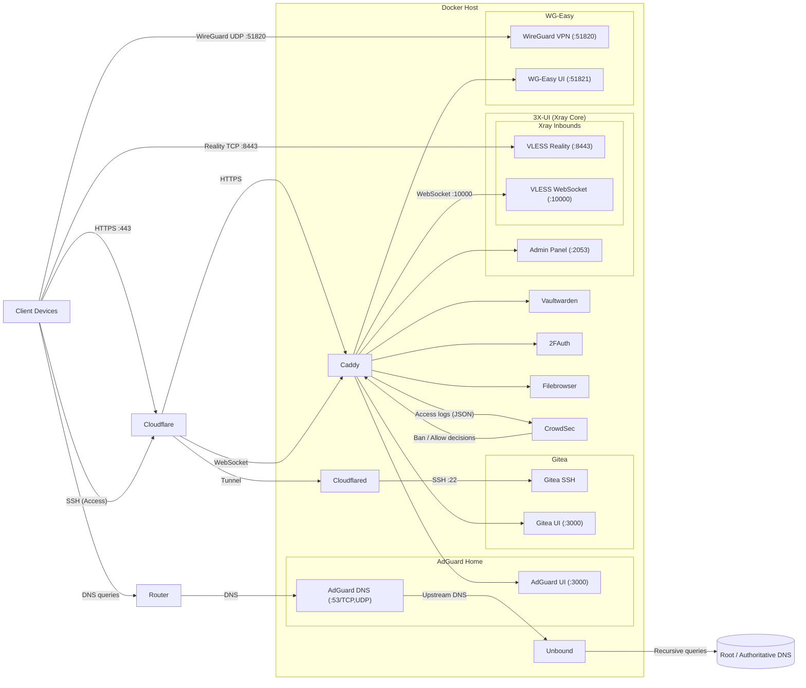

# Homelab Setup

This repository contains the configuration for my personal homelab stack, built with Docker Compose, fronted by Caddy as a secure reverse proxy, and backed by ZFS for storage integrity and snapshots.

The goal of this setup is to be simple, secure, resilient, and easy to maintain, while providing essential self-hosted services for daily use.

- Automatic HTTPS (Caddy + ACME + DNS-01)
- Dynamic DNS with Cloudflare
- Password management & 2FA
- WireGuard VPN with web UI
- Network-wide ad & tracker blocking
- CrowdSec behavior-based security
- Recursive DNS with Unbound + Redis cachedb
- Xray / V2Ray management via 3x-ui (panel behind HTTPS)
  - VLESS Reality
  - VLESS WebSocket Cloudflare-proxied
- Fully containerized (Docker Compose)
- ZFS-backed persistent storage with mirrored disks
- Per-service datasets for important stateful services
- Snapshots for rollback and safer upgrades
- Monitoring, logs, and uptime checks
- Auto-start on boot

| Service          | Description                                               | Access                          |
| ---------------- | --------------------------------------------------------- | ------------------------------- |
| **Vaultwarden**  | Bitwarden-compatible password manager                     | `https://vault.example.com`     |
| **2FAuth**       | Self-hosted two-factor authentication manager             | `https://auth.example.com`      |
| **Filebrowser**  | Lightweight web-based file manager                        | `https://storage.example.com`   |
| **AdGuard Home** | DNS-level ad & tracker blocking                           | `https://dns.example.com`       |
| **Unbound**      | Recursive DNS resolver (DNSSEC, Redis cachedb)            | *Internal*                      |
| **WG-Easy**      | WireGuard VPN with management UI                          | `https://vpn.example.com`       |
| **3x-ui**        | Xray / V2Ray management panel                             | `https://xui.example.com/admin` |
| **Gitea**        | Self-hosted Git service (“Git with a cup of tea ☕”)      | `https://git.example.com`       |
| **Gitea SSH**    | Git-over-SSH via Cloudflare Tunnel + Access               | `ssh.example.com`               |
| **Crowdsec**     | Behavior-based intrusion detection & prevention (IDS/IPS) | *Internal (via Caddy bouncer)*  |
| **Caddy**        | Reverse proxy with automatic HTTPS                        | *No direct UI*                  |
| **Portainer**    | Docker container management                               | `https://<SERVER_IP>:9443`      |
| **Uptime Kuma**  | Uptime & service monitoring                               | `http://<SERVER_IP>:3001`       |
| **Dozzle**       | Real-time Docker log viewer                               | `http://<SERVER_IP>:9999`       |
| **Netdata**      | System & container performance monitoring                 | `http://<SERVER_IP>:19999`      |

## Table of Contents

- [Homelab Setup](#homelab-setup)
  - [Table of Contents](#table-of-contents)
  - [Architecture](#architecture)
  - [DNS \& Proxy Model](#dns--proxy-model)
    - [Cloudflare-proxied domains (orange cloud)](#cloudflare-proxied-domains-orange-cloud)
    - [DNS-only domains (grey cloud)](#dns-only-domains-grey-cloud)
    - [Cloudflare Tunnel domains (no public inbound ports)](#cloudflare-tunnel-domains-no-public-inbound-ports)
  - [Directory Structure](#directory-structure)
  - [Instructions](#instructions)
    - [0A. Port Forwarding on Your Router](#0a-port-forwarding-on-your-router)
    - [0B. Setting up ZFS](#0b-setting-up-zfs)
    - [1. Secrets and Environment Variables](#1-secrets-and-environment-variables)
    - [2. Cloudflare Dynamic DNS Updater](#2-cloudflare-dynamic-dns-updater)
      - [Run manually if needed](#run-manually-if-needed)
      - [Cron to run periodically (recommended)](#cron-to-run-periodically-recommended)
    - [3. Update `root.hints` for Unbound](#3-update-roothints-for-unbound)
    - [4. Host Requirement: Disable `systemd-resolved` DNS Stub (Port 53)](#4-host-requirement-disable-systemd-resolved-dns-stub-port-53)
    - [5. Connect Crowdsec and Caddy](#5-connect-crowdsec-and-caddy)
    - [6. Homelab Stack (Docker Compose)](#6-homelab-stack-docker-compose)
      - [Start the stack](#start-the-stack)
      - [Stop the stack](#stop-the-stack)
      - [View logs](#view-logs)
      - [Auto-start on system boot](#auto-start-on-system-boot)
      - [Set correct permissions for volumes (optional)](#set-correct-permissions-for-volumes-optional)
      - [Updating](#updating)
    - [7. Set your router to use Adguard + Unbound](#7-set-your-router-to-use-adguard--unbound)
    - [8. Configure Cloudflare Tunnel and Zero Trust for SSH](#8-configure-cloudflare-tunnel-and-zero-trust-for-ssh)
      - [8.1. Create the Cloudflare Tunnel](#81-create-the-cloudflare-tunnel)
      - [8.2. Configure Zero Trust Application Access](#82-configure-zero-trust-application-access)
      - [8.3. Configure the Client](#83-configure-the-client)
    - [9. Configure 3X-UI for Reverse Proxy](#9-configure-3x-ui-for-reverse-proxy)
    - [10. Note on Xray inbounds' Configs](#10-note-on-xray-inbounds-configs)
      - [Server](#server)
      - [Client](#client)
  - [Migrate to new server + new disks](#migrate-to-new-server--new-disks)
  - [Migrate to new server + 4 old disks](#migrate-to-new-server--4-old-disks)
  - [ZFS Maintenance: Scrub and Resilver](#zfs-maintenance-scrub-and-resilver)
    - [Scrubbing the Pool](#scrubbing-the-pool)
    - [Resilvering (Disk Replacement)](#resilvering-disk-replacement)
  - [Future roadmap](#future-roadmap)

## Architecture


```mermaid
flowchart LR
    Client["Client Devices"]

    %% DNS flow
    Client -->|"DNS queries"| Router
    Router -->|"DNS"| AdGuardDNS
    AdGuardDNS -->|"Upstream DNS"| Unbound
    Unbound -->|"Recursive queries"| InternetDNS[(Root / Authoritative DNS)]

    %% Entry points
    Client -->|"HTTPS :443"| Cloudflare
    Client -->|Reality TCP :8443| XrayReality
    Client -->|WireGuard UDP :51820| WireGuardVPN
    Client -->|"SSH (Access)"| Cloudflare

    %% Web & CDN flow
    Cloudflare -->|"HTTPS"| Caddy
    Cloudflare -->|"Tunnel"| Cloudflared

    %% SSH tunnel
    Cloudflared -->|"SSH :22"| GiteaSSH

    %% Reverse proxy targets
    Caddy --> Vaultwarden
    Caddy --> TwoFAuth["2FAuth"]
    Caddy --> Filebrowser
    Caddy --> GiteaUI["Gitea UI"]
    Caddy --> AdGuardUI["AdGuard UI"]
    Caddy --> WGEasyUI["WG-Easy UI"]
    Caddy --> XUIAdmin["3X-UI Admin Panel"]

    %% CrowdSec integration
    Caddy -->|"Access logs (JSON)"| CrowdSec
    CrowdSec -->|"Ban / Allow decisions"| Caddy

    %% VLESS over CDN (WebSocket only)
    Cloudflare -->|"WebSocket"| Caddy
    Caddy -->|WebSocket :10000| XrayWS

    %% Containers
    subgraph DockerHost["Docker Host"]
        Caddy
        Vaultwarden
        TwoFAuth
        Filebrowser
        Unbound
        Cloudflared
        CrowdSec

        subgraph AdGuardHome["AdGuard Home"]
            AdGuardDNS["AdGuard DNS (:53/TCP,UDP)"]
            AdGuardUI["AdGuard UI (:3000)"]
        end

        subgraph Gitea["Gitea"]
            GiteaSSH["Gitea SSH"]
            GiteaUI["Gitea UI (:3000)"]
        end

        subgraph XUI["3X-UI (Xray Core)"]
            XUIAdmin["Admin Panel (:2053)"]

            subgraph XrayInbounds["Xray Inbounds"]
                XrayWS["VLESS WebSocket (:10000)"]
                XrayReality["VLESS Reality (:8443)"]
            end
        end

        subgraph WireGuardStack["WG-Easy"]
            WireGuardVPN["WireGuard VPN (:51820)"]
            WGEasyUI["WG-Easy UI (:51821)"]
        end
    end
```

## DNS & Proxy Model

This homelab intentionally uses multiple access methods, each optimized for a different network environment. Not all traffic is treated equally, and Cloudflare proxying is applied selectively based on protocol requirements and threat model.

| Method                    | Cloudflare | Protocol         | Purpose                               |
| ------------------------- | ---------- | ---------------- | ------------------------------------- |
| **Web UIs**               | ✅ Proxied | HTTPS            | Normal apps & dashboards              |
| **Gitea SSH**             | ✅ Tunnel  | SSH (TCP/22)     | Secure Git access via Zero Trust      |
| **VLESS Reality**         | ❌ DNS-only| Raw TCP + TLS    | Stealth / censorship-resistant access |
| **VLESS WebSocket (CDN)** | ✅ Proxied | HTTP / WebSocket | Compatibility fallback                |
| **WireGuard**             | ❌ DNS-only| UDP              | Non-HTTP infrastructure               |

### Cloudflare-proxied domains (orange cloud)

These domains are public-facing HTTP(S) services and benefit from Cloudflare’s CDN, TLS termination, and basic DDoS protection.

- vault.example.com
- auth.example.com
- cloud.example.com
- git.example.com
- xui.example.com
- dns.example.com

### DNS-only domains (grey cloud)

WireGuard and Reality must bypass Cloudflare because they are non-HTTP protocols.

- vpn.example.com
  - Wireguard's management UI should not be exposed to the public internet. Think carefully if you want to do this!
- reality.example.com

### Cloudflare Tunnel domains (no public inbound ports)

These hostnames are reached via **Cloudflare Tunnel** and protected with **Cloudflare Access**. They do not require port forwarding on the router.

- ssh.example.com

## Directory Structure

The homelab uses a split layout:

- `/opt/homelab` stores Docker Compose, reverse proxy config, scripts, and other project files
- `/tank/services` stores persistent service data on ZFS

```bash
.
├── homelab
│   ├── Caddyfile                # Caddy reverse proxy configuration
│   ├── cloudflare
│   │   └── cloudflare_ddns.sh   # Cloudflare Dynamic DNS updater
│   ├── compose.yml              # Docker Compose stack
│   ├── Dockerfile               # Custom Caddy build
│   └── services
│       ├── crowdsec
│       │   └── acquis.d
│       │       └── caddy.yml    # Crowdsec's Caddy configuration
│       ├── gitea
│       │   └── runner
│       │       └── config.yaml  # Gitea Runner configuration
│       └── unbound
│           ├── custom.conf.d    # Unbound modular configuration
│           └── root.hints
```

___

## Instructions

### 0A. Port Forwarding on Your Router

| Purpose           | External  | Internal | Proto   | Notes                                |
| ----------------- | --------- | -------- | ------- | ------------------------------------ |
| **HTTPS (Caddy)** | **443**   | 443      | TCP/UDP | HTTP/3 (QUIC) supported              |
| **HTTP (ACME)**   | **80**    | 80       | TCP     | Redirects + ACME fallback            |
| **WireGuard VPN** | **51820** | 51820    | UDP     | Main VPN tunnel                      |
| **Reality**       | 8443      | 8443     | TCP     | XTLS Reality (DNS-only, not proxied) |

___

### 0B. Setting up ZFS

1. Install ZFS:

   ```bash
   sudo apt install zfsutils-linux
   whereis zfs
   ```

2. List stable disk IDs:

   ```bash
   ls -l /dev/disk/by-id/ | grep -E '<E.g., Samsung, Kingston, Crucial, etc.'
   ```

3. Create two mirrored vdevs built from four disks:

   ```bash
   sudo zpool create -f \
     -o ashift=12 \
     -O compression=lz4 \
     -O atime=off \
     -O xattr=sa \
     -O acltype=posixacl \
     -O dnodesize=auto \
     -O mountpoint=/tank \
     tank \
     mirror /dev/disk/by-id/<disk_a> \
           /dev/disk/by-id/<disk_b> \
     mirror /dev/disk/by-id/<disk_c> \
           /dev/disk/by-id/<disk_d>
   ```

4. Enable automatic SSD trim:

   ```bash
   sudo zpool set autotrim=on tank
   ```

5. Verify the pool:

   ```bash
   zpool status
   zpool list
   zfs list
   ```

6. Create datasets:

   ```bash
   sudo zfs create tank/services
   sudo zfs create tank/services/2fauth
   sudo zfs create tank/services/3x-ui
   sudo zfs create tank/services/adguard
   sudo zfs create tank/services/caddy
   sudo zfs create tank/services/crowdsec
   sudo zfs create tank/services/dozzle
   sudo zfs create tank/services/filebrowser
   sudo zfs create tank/services/gitea
   sudo zfs create tank/services/gitea/postgres
   sudo zfs create tank/services/portainer
   sudo zfs create tank/services/unbound
   sudo zfs create tank/services/unbound/redis
   sudo zfs create tank/services/vaultwarden
   sudo zfs create tank/services/wg-easy
   ```

   For PostgreSQL and Redis, use a smaller record size:

   ```bash
   sudo zfs set recordsize=16K tank/services/gitea/postgres
   sudo zfs set recordsize=16K tank/services/unbound/redis
   ```

7. Enable automatic snapshots:

   ```bash
   sudo apt install zfs-auto-snapshot
   ```

8. Copy configs to ZFS:

   ```bash
   sudo mkdir -p /tank/services/crowdsec/acquis.d
   sudo mkdir -p /tank/services/gitea/runner
   sudo mkdir -p /tank/services/unbound/custom.conf.d

   sudo cp /opt/homelab/services/crowdsec/acquis.d/caddy.yml /tank/services/crowdsec/acquis.d/
   sudo cp /opt/homelab/services/gitea/runner/config.yaml /tank/services/gitea/runner/
   sudo cp /opt/homelab/services/unbound/custom.conf.d/cachedb.conf /tank/services/unbound/custom.conf.d/
   sudo cp /opt/homelab/services/unbound/root.hints /tank/services/unbound/
   ```

___

### 1. Secrets and Environment Variables

Before running the stack, set environment variables:

   ```bash
   cp /opt/homelab/.env.example homelab/.env
   ```

You MUST replace all placeholder values!

> Note! Cloudflare API token must have permissions: `Zone.Zone:Read` and `Zone.DNS:Edit`.
___

### 2. Cloudflare Dynamic DNS Updater

The script creates or updates all domains used by the homelab.

#### Run manually if needed

```bash
cd /opt/homelab/cloudflare
./cloudflare_ddns.sh
```

#### Cron to run periodically (recommended)

```bash
cd /opt/homelab/cloudflare
chmod 700 cloudflare_ddns.sh
crontab -e
```

Add:

```bash
*/5 * * * * /opt/homelab/cloudflare/cloudflare_ddns.sh >/dev/null 2>&1
```

This ensures your Cloudflare domains always point to your current IP.

___

### 3. Update `root.hints` for Unbound

Automatically update the root hints file every year on 1st January at 3:00.

```bash
crontab -e
```

Add:

```bash
0 3 1 1 * \
cd /tank/services/unbound && \
curl -fsS -o root.hints.new https://www.internic.net/domain/named.root && \
mv root.hints.new root.hints && \
cd /opt/homelab && docker compose restart unbound
```

___

### 4. Host Requirement: Disable `systemd-resolved` DNS Stub (Port 53)

On most modern Linux distributions (including Ubuntu, Debian, Linux Mint, etc.),
`systemd-resolved` runs a DNS stub listener on `127.0.0.53:53`. This conflicts with AdGuard Home, which needs to bind to port 53 (TCP/UDP).

If this is not disabled, Docker will fail to start AdGuard Home with an error: `failed to bind port 53: address already in use`.

1. Create a systemd override for `systemd-resolved`:

   Create the directory if it does not exist:

   ```bash
   sudo mkdir -p /etc/systemd/resolved.conf.d
   ```

   Create the config file:

   ```bash
   sudo nano /etc/systemd/resolved.conf.d/adguardhome.conf
   ```

   Add:

   ```conf
   [Resolve]
   DNS=127.0.0.1
   DNSStubListener=no
   ```

2. Switch to the correct `resolv.conf`:

   ```bash
   sudo mv /etc/resolv.conf /etc/resolv.conf.backup
   sudo ln -s /run/systemd/resolve/resolv.conf /etc/resolv.conf
   ```

3. Restart `systemd-resolved`:

   ```bash
   sudo systemctl reload-or-restart systemd-resolved
   ```

___

### 5. Connect Crowdsec and Caddy

1. Generate Crowdsec API key for Caddy:

   ```bash
   docker exec -it crowdsec cscli bouncers add caddy-bouncer
   ```

2. Copy the value and put it in `.env` as `CROWDSEC_API_KEY`

___

### 6. Homelab Stack (Docker Compose)

The `/opt/homelab/` directory contains everything needed to run the stack.

#### Start the stack

```bash
cd /opt/homelab
docker compose up -d
```

#### Stop the stack

```bash
cd /opt/homelab
docker compose down
```

#### View logs

```bash
docker logs <container> -f
```

#### Auto-start on system boot

The containers already use:

```yml
restart: always
```

But remember to enable Docker on startup:

```bash
sudo systemctl enable docker
```

#### Set correct permissions for volumes (optional)

Run:

```bash
cd /opt/homelab
sudo chown -R 1000:1000 services
sudo chmod -R 755 services
```

Then restart the containers:

```bash
cd /opt/homelab
docker compose restart
```

#### Updating

To update to the latest versions:

```bash
cd /opt/homelab
docker compose pull
docker compose up -d
```

This will refresh all Docker images with zero downtime.

___

### 7. Set your router to use Adguard + Unbound

Go to Adguard Home's UI, navigate to ***DNS settings*** and set **Upstream DNS servers** to `10.2.0.53`.

Go to your router's admin UI and set Primary DNS to `<local.server.ip.addr>`. Leave Secondary DNS empty.

Perform a sanity check at [www.dnsleaktest.com](https://www.dnsleaktest.com). If the resolver IP = your ISP IP and NOT Google, Cloudflare, Quad9, etc., it's working.

___

### 8. Configure Cloudflare Tunnel and Zero Trust for SSH

#### 8.1. Create the Cloudflare Tunnel

1. In Cloudflare Dashboard, navigate to ***Zero Trust*** > ***Networks*** > ***Connectors***
2. Create a new **Cloudflared** tunnel
3. Give it a name, e.g., `Gitea SSH`
4. Copy the tunnel token and put it in `.env` as `CF_TUNNEL_TOKEN`
5. Go to the ***Published hostname routes*** and add a new entry:

    | Hostname                  |               |                  |
    | ------------------------- | ------------- | ---------------- |
    | *Subdomain*               | *Domain*      | *Path*           |
    | `ssh`                     | `example.com` |                  |

    | Service                   |               |
    | ------------------------- | ------------- |
    | *Type*                    | *URL*         |
    | `SSH`                     | `gitea:22`    |

6. Update `cloudflared` container with the token:

    ```bash
    cd /opt/homelab
    docker compose up -d cloudflared
    ```

#### 8.2. Configure Zero Trust Application Access

1. In Cloudflare Dashboard, navigate to ***Zero Trust*** > ***Access controls*** > ***Applications***
2. Add a new **Self-hosted** application:

    | Basic information                      |                            |
    | -------------------------------------- | -------------------------- |
    | *Application name*                     | *Session duration*         |
    | `Gitea SSH` or something else you like | 24 hours                   |

    | Public hostname           |               |               |                  |
    | ------------------------- | ------------- | ------------- | ---------------- |
    | *Input method*            | *Subdomain*   | *Domain*      | *Path*           |
    | Default                   | `ssh`         | `example.com` |                  |

3. Add **Access policies** based on your preference
4. Add some other **Login methods**; do NOT rely on `One-time PIN`

#### 8.3. Configure the Client

1. Install `cloudflared` from the [official release](https://github.com/cloudflare/cloudflared/releases) on the client machine.
2. Edit `~/.ssh/config`:

    ```ssh
    Host git.example.com
    HostName ssh.yourdomain.com
    User git
    ProxyCommand cloudflared access ssh --hostname %h
    IdentityFile ~/.ssh/<your_gitea_private_ssh_key>
    ```

    > Remember to add the public key to Gitea!

3. Authenticate with Cloudflare

    The first time you connect, a browser window will be opened for authentication:

    ```bash
    ssh git@git.example.com
    ```

    You should see:

    ```bash
    A browser window should have opened for you to authenticate.
    If it didn't, please visit: https://ssh.example.com/...
    ```

    The certificate will then be cached locally and valid for the next 24 hours.

4. Verify the tunnel health in Cloudflare Dashboard: <span style="background-color: #2e7d32; color: white; padding: 2px 6px; border-radius: 4px; font-weight: bold;">HEALTHY</span>
5. Test the SSH connection:

    ```bash
    ssh -T git@git.example.com
    ```

    You should see:

    ```bash
    Hi there, <username>! You've successfully authenticated with the key named <key_name>, but Gitea does not provide shell access.
    If this is unexpected, please log in with password and setup Gitea under another user.
    ```

> You will need to authenticate yourself again after 24 hours.
___

### 9. Configure 3X-UI for Reverse Proxy

1. Navigate to `http://<local.server.ip.addr>:2053` and log in with:

   ```bash
     Username: admin
     Password: admin
   ```

2. Go to ***Panel Settings*** > ***General*** and change **URI Path** to `/admin/`, then save.
3. Go to ***Panel Settings*** > ***Authentication*** and change the administrator credentials. Login again.
4. Restart 3X-UI.

___

### 10. Note on Xray inbounds' Configs

#### Server

| Transport     | Listen IP | Port    | TLS / Security | Transmission | Path          | Client's Flow      | CDN    | Notes                                |
| ------------- | --------- | ------- | -------------- | ------------ | ------------- | ------------------ | ------ | ------------------------------------ |
| **Reality**   | `0.0.0.0` | `8443`  | Reality (XTLS) | `tcp`        | N/A           | `xtls-rprx-vision` | ❌ No  | Direct connection, fake SNI, no cert |
| **WebSocket** | `0.0.0.0` | `10000` | TLS (via CDN)  | `ws`         | `/ws`         | N/A                | ✅ Yes | Compatibility fallback               |

#### Client

| Transport     | Address               | Port   | TLS     | Network | Flow               | Path / Service     | SNI / Host                  | When to Use          |
| ------------- | --------------------- | ------ | ------- | ------- | ------------------ | ------------------ | --------------------------- | -------------------- |
| **Reality**   | `reality.example.com` | `8443` | Reality | `tcp`   | `xtls-rprx-vision` | N/A                | Fake SNI (e.g. `apple.com`) | Stealth / censorship |
| **WebSocket** | `xui.example.com`     | `443`  | TLS     | `ws`    | N/A                | `/ws`              | `xui.example.com`           | Fallback             |

___

## Migrate to new server + new disks

1. Prepare the new server:

   - Install Docker & Docker Compose
   - Install and configure ZFS
   - Create the same user
   - Ensure required ports are available (see port forwarding table above)
   - Set the correct timezone

2. Create and mount the ZFS pool:

   Recreate the pool layout on the new server (see [0B. Setting up ZFS](#0b-setting-up-zfs)).

   Ensure `/tank` and `/tank/services` exist and are mounted:

   ```bash
   zfs list
   ```

3. Clone this repository:

   ```bash
   git clone <repo-url> /opt/homelab
   ```

4. Restore environment variables:

   ```bash
   scp .env user@new-server:/opt/homelab/.env
   ```

5. Stop containers on the old server:

   ```bash
   cd /opt/homelab
   docker compose stop
   ```

6. Restore persistent data (ZFS):

   ```bash
   rsync -aHAX --numeric-ids --progress /tank/services/ user@new-server:/tank/services/
   ```

7. Restore repository/config files:

   ```bash
   rsync -a --progress /opt/homelab/ user@new-server:/opt/homelab/
   ```

8. Start the stack on the new server:

   ```bash
   cd /opt/homelab
   docker compose up -d
   ```

9. Verify services:

   ```bash
   docker ps
   zpool status
   ```

___

## Migrate to new server + 4 old disks

1. On old server:

   ```bash
   sudo zpool export tank
   ```

2. Move the disks and plug them in their new home.
3. Install and configure ZFS on the new server.
4. On new server:

   ```bash
   sudo zpool import
   ```

   You should see:

   ```bash
   pool: tank
   ```

   Then:

   ```bash
   sudo zpool import tank
   ```

___

## ZFS Maintenance: Scrub and Resilver

ZFS provides built-in mechanisms to maintain data integrity and recover from disk failures. The two most important operations are **scrub** and **resilver**.

### Scrubbing the Pool

A **scrub** verifies data integrity by reading all data and checking checksums. If corruption is detected and redundancy exists (e.g. mirrors), ZFS will automatically repair it.

```bash
sudo zpool scrub tank
```

Check scrub progress:

```bash
zpool status
```

Example output:

```bash
scan: scrub in progress since ...
    120G scanned, 45G issued, 10G repaired, 2h to go
```

Schedule via cron:

```bash
crontab -e
0 3 1 * * /sbin/zpool scrub tank
```

### Resilvering (Disk Replacement)

A resilver occurs when a disk is replaced or reattached. ZFS rebuilds data onto the new disk using redundancy from the remaining disks.

1. Identify the failed disk:

   ```bash
   zpool status
   ```

2. Replace it with a new disk and run (use `/dev/disk/by-id`):

   ```bash
   sudo zpool replace tank <old-disk> <new-disk>
   ```

3. Monitor resilver progress:

   ```bash
   zpool status
   ```

   Example output:

   ```bash
   scan: resilver in progress since ...
       80G scanned, 35G resilvered, 1h to go
   ```

   > - The pool remains online and usable during resilver
   > - Performance may be reduced during the process
   > - Only used data is copied (not empty space), making resilver faster than traditional RAID rebuilds

___

## Future roadmap

1. Auth gateway (OIDC / SSO) in front of all services
2. Cockpit for interactive system control
3. Home Assistant for smart home devices (I hate big techs)
4. Jellyfin with GPU
5. Ollama to make Home Assistant smarter
6. Grafana for long-term metric aggregation
7. UPS for graceful shutdown and storage safety (unlikely to happen; do we ever get power outage in Finland?)
