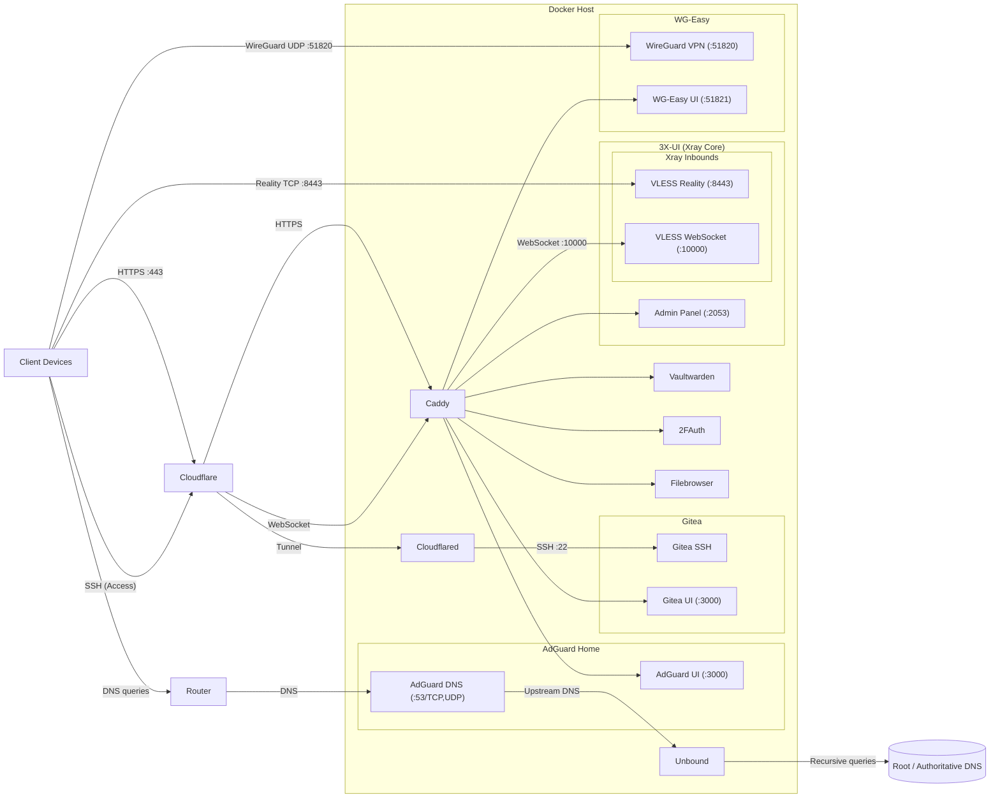

# Homelab Setup

This repository contains the configuration for my personal homelab stack, built with Docker Compose and fronted by Caddy as a secure reverse proxy.

The goal of this setup is to be simple, secure, and easy to maintain, while providing essential self-hosted services for daily use.

- Automatic HTTPS (Caddy + ACME + DNS-01)
- Dynamic DNS with Cloudflare
- Password management & 2FA
- WireGuard VPN with web UI
- Network-wide ad & tracker blocking
- Recursive DNS with Unbound + Redis cachedb
- Xray / V2Ray management via 3x-ui (panel behind HTTPS)
  - VLESS Reality
  - VLESS Websocket Cloudflare-proxied
- Fully containerized (Docker Compose)
- Monitoring, logs, and uptime checks
- Zero-downtime updates
- Auto-start on boot

| Service          | Description                                         | Access                          |
| ---------------- | --------------------------------------------------- | ------------------------------- |
| **Vaultwarden**  | Bitwarden-compatible password manager               | `https://vault.example.com`     |
| **2FAuth**       | Self-hosted two-factor authentication manager       | `https://auth.example.com`      |
| **Filebrowser**  | Lightweight web-based file manager                  | `https://storage.example.com`   |
| **AdGuard Home** | DNS-level ad & tracker blocking                     | `https://dns.example.com`       |
| **Unbound**      | Recursive DNS resolver (DNSSEC, Redis cachedb)      | *Internal*                      |
| **WG-Easy**      | WireGuard VPN with management UI                    | `https://vpn.example.com`       |
| **3x-ui**        | Xray / V2Ray management panel                       | `https://xui.example.com/admin` |
| **Gitea**        | Self-hosted Git service (“Git with a cup of tea ☕”) | `https://git.example.com`       |
| **Gitea SSH**    | Git-over-SSH via Cloudflare Tunnel + Access         | `ssh.example.com`               |
| **Caddy**        | Reverse proxy with automatic HTTPS                  | *No direct UI*                  |
| **Portainer**    | Docker container management                         | `https://<SERVER_IP>:9443`      |
| **Uptime Kuma**  | Uptime & service monitoring                         | `http://<SERVER_IP>:3001`       |
| **Dozzle**       | Real-time Docker log viewer                         | `http://<SERVER_IP>:9999`       |
| **Netdata**      | System & container performance monitoring           | `http://<SERVER_IP>:19999`      |

## Architecture



## DNS & Proxy Model

This homelab intentionally uses multiple access methods, each optimized for a different network environment. Not all traffic is treated equally, and Cloudflare proxying is applied selectively based on protocol requirements and threat model.

| Method                    | Cloudflare | Protocol         | Purpose                               |
| ------------------------- | ---------- | ---------------- | ------------------------------------- |
| **Web UIs**               | ✅ Proxied | HTTPS            | Normal apps & dashboards              |
| **Gitea SSH**             | ✅ Tunnel  | SSH (TCP/22)     | Secure Git access via Zero Trust      |
| **VLESS Reality**         | ❌ DNS-only| Raw TCP + TLS    | Stealth / censorship-resistant access |
| **VLESS WebSocket (CDN)** | ✅ Proxied | HTTP / WebSocket | Compatibility fallback                |
| **WireGuard**             | ❌ DNS-only| UDP              | Non-HTTP infrastructure               |

### Cloudflare-proxied domains (orange cloud)

These domains are public-facing HTTP(S) services and benefit from Cloudflare’s CDN, TLS termination, and basic DDoS protection.

- vault.example.com
- auth.example.com
- cloud.example.com
- git.example.com
- xui.example.com
- dns.example.com

### DNS-only domains (grey cloud)

WireGuard and Reality must bypass Cloudflare because they are non-HTTP protocols.

- vpn.example.com
  - Wireguard's management UI should not be exposed to the public internet. Think carefully if you want to do this!
- reality.example.com

### Cloudflare Tunnel domains (no public inbound ports)

These hostnames are reached via **Cloudflare Tunnel** and protected with **Cloudflare Access**. They do not require port forwarding on the router.

- ssh.example.com

## Directory Structure

```bash
.
├── homelab
│   ├── compose.yml              # Docker Compose stack
│   ├── Caddyfile                # Caddy reverse proxy configuration
│   ├── Dockerfile               # Custom Caddy build (Cloudflare DNS plugin)
│   ├── .env.example             # Shared environment variable template
│   ├── cloudflare
│   │   └── cloudflare-ddns.sh   # Cloudflare Dynamic DNS updater
│   └── services
│       └── unbound
│           ├── custom.conf.d    # Unbound modular configuration
│           └── root.hints
```

___

## Instructions

### 0. Port Forwarding on Your Router

| Purpose           | External  | Internal | Proto   | Required  | Notes                                |
| ----------------- | --------- | -------- | ------- | --------- | ------------------------------------ |
| **HTTPS (Caddy)** | **443**   | 443      | TCP/UDP | ✅ Yes    | HTTP/3 (QUIC) supported              |
| **HTTP (ACME)**   | **80**    | 80       | TCP     | ✅ Yes    | Redirects + ACME fallback            |
| **WireGuard VPN** | **51820** | 51820    | UDP     | ✅ Yes    | Main VPN tunnel                      |
| **Reality**       | 8443      | 8443     | TCP     | ✅ Yes    | XTLS Reality (DNS-only, not proxied) |

___

### 1. Secrets and Environment Variables

Before running the stack:

1. Copy environment variables:

   ```bash
   cp homelab/.env.example homelab/.env
   ```

2. Replace all placeholder values
3. Add Cloudflare API token and the root domain.

> Note! Cloudflare API token must have permissions: `Zone.Zone:Read` and `Zone.DNS:Edit`.
___

### 2. Cloudflare Dynamic DNS Updater

The script creates or updates all domains used by the homelab.

#### Run manually if needed

```bash
cd cloudflare
./cloudflare_ddns.sh
```

#### Cron to run periodically (recommended)

```bash
cd cloudflare
chmod 700 cloudflare_ddns.sh
crontab -e
```

Add:

```bash
*/5 * * * * /path/to/cloudflare/cloudflare_ddns.sh >/dev/null 2>&1
```

This ensures your Cloudflare domains always point to your current IP.

___

### 3. Update `root.hints` for Unbound

Automatically update the root hints file every year on 1st January at 3:00.

```bash
crontab -e
```

Add:

```bash
0 3 1 1 * cd /path/to/homelab/services/unbound && \
curl -fsS -o root.hints https://www.internic.net/domain/named.root && \
cd /path/to/homelab && docker compose restart unbound
```

___

### 4. Host Requirement: Disable `systemd-resolved` DNS Stub (Port 53)

On most modern Linux distributions (including Ubuntu, Debian, Linux Mint, etc.),
`systemd-resolved` runs a DNS stub listener on `127.0.0.53:53`. This conflicts with AdGuard Home, which needs to bind to port 53 (TCP/UDP).

If this is not disabled, Docker will fail to start AdGuard Home with an error: `failed to bind port 53: address already in use`.

1. Create a systemd override for `systemd-resolved`:

   Create the directory if it does not exist:

   ```bash
   sudo mkdir -p /etc/systemd/resolved.conf.d
   ```

   Create the config file:

   ```bash
   sudo nano /etc/systemd/resolved.conf.d/adguardhome.conf
   ```

   Add:

   ```conf
   [Resolve]
   DNS=127.0.0.1
   DNSStubListener=no
   ```

2. Switch to the correct `resolv.conf`:

   ```bash
   sudo mv /etc/resolv.conf /etc/resolv.conf.backup
   sudo ln -s /run/systemd/resolve/resolv.conf /etc/resolv.conf
   ```

3. Restart `systemd-resolved`:

   ```bash
   sudo systemctl reload-or-restart systemd-resolved
   ```

___

### 5. Homelab Stack (Docker Compose)

The `homelab/` directory contains everything needed to run the stack.

#### Start the stack

```bash
cd homelab
docker compose up -d
```

#### Stop the stack

```bash
cd homelab
docker compose down
```

#### View logs

```bash
docker logs <container> -f
```

#### Auto-start on system boot

The containers already use:

```yml
restart: always
```

But remember to enable Docker on startup:

```bash
sudo systemctl enable docker
```

#### Set correct permissions for volumes (optional)

Run:

```bash
cd homelab
sudo chown -R 1000:1000 services
sudo chmod -R 755 services
```

Then restart the containers:

```bash
cd homelab
docker compose restart
```

#### Updating

To update to the latest versions:

```bash
cd homelab
docker compose pull
docker compose up -d
```

This will refresh all Docker images with zero downtime.

___

### 6. Set your router to use Adguard + Unbound

Go to Adguard Home's UI, navigate to ***DNS settings*** and set **Upstream DNS servers** to `10.2.0.53`.

Go to your router's admin UI and set Primary DNS to `<local.server.ip.addr>`. Leave Secondary DNS empty.

Perform a sanity check at [www.dnsleaktest.com](https://www.dnsleaktest.com). If the resolver IP = your ISP IP and NOT Google, Cloudflare, Quad9, etc., it's working.

___

### 7. Configure Cloudflare Tunnel and Zero Trust for SSH

#### 7.1. Create the Cloudflare Tunnel

1. In Cloudflare Dashboard, navigate to ***Zero Trust*** > ***Networks*** > ***Connectors***
2. Create a new **Cloudflared** tunnel
3. Give it a name, e.g., `Gitea SSH`
4. Copy the tunnel token and put it in `.env` as `CF_TUNNEL_TOKEN`
5. Go to the ***Published hostname routes*** and add a new entry:

    | Hostname                  |               |                  |
    | ------------------------- | ------------- | ---------------- |
    | *Subdomain*               | *Domain*      | *Path*           |
    | `ssh`                     | `example.com` |                  |

    | Service                   |               |
    | ------------------------- | ------------- |
    | *Type*                    | *URL*         |
    | `SSH`                     | `gitea:22`    |

6. Update `cloudflared` container with the token:

    ```bash
    cd homelab
    docker compose up -d cloudflared
    ```

#### 7.2. Configure Zero Trust Application Access

1. In Cloudflare Dashboard, navigate to ***Zero Trust*** > ***Access controls*** > ***Applications***
2. Add a new **Self-hosted** application:

    | Basic information                      |                            |
    | -------------------------------------- | -------------------------- |
    | *Application name*                     | *Session duration*         |
    | `Gitea SSH` or something else you like | 24 hours                   |

    | Public hostname           |               |               |                  |
    | ------------------------- | ------------- | ------------- | ---------------- |
    | *Input method*            | *Subdomain*   | *Domain*      | *Path*           |
    | Default                   | `ssh`         | `example.com` |                  |

3. Add **Access policies** based on your preference
4. Add some other **Login methods**; do NOT rely on `One-time PIN`

#### 7.3. Configure the Client

1. Install `cloudflared` from the [official release](https://github.com/cloudflare/cloudflared/releases) on the client machine.
2. Edit `~/.ssh/config`:

    ```ssh
    Host git.example.com
    HostName ssh.yourdomain.com
    User git
    ProxyCommand cloudflared access ssh --hostname %h
    IdentityFile ~/.ssh/<your_gitea_private_ssh_key>
    ```

    > Remember to add the public key to Gitea!

3. Authenticate with Cloudflare

    The first time you connect, a browser window will be opened for authentication:

    ```bash
    ssh git@git.example.com
    ```

    You should see:

    ```bash
    A browser window should have opened for you to authenticate.
    If it didn't, please visit: https://ssh.example.com/...
    ```

    The certificate will then be cached locally and valid for the next 24 hours.

4. Verify the tunnel health in Cloudflare Dashboard: <span style="background-color: #2e7d32; color: white; padding: 2px 6px; border-radius: 4px; font-weight: bold;">HEALTHY</span>
5. Test the SSH connection:

    ```bash
    ssh -T git@git.example.com
    ```

    You should see:

    ```bash
    Hi there, <username>! You've successfully authenticated with the key named <key_name>, but Gitea does not provide shell access.
    If this is unexpected, please log in with password and setup Gitea under another user.
    ```

___

### 8. Configure 3X-UI for Reverse Proxy

1. Navigate to `http://<local.server.ip.addr>:2053` and log in with:

   ```bash
     Username: admin
     Password: admin
   ```

2. Go to ***Panel Settings*** > ***General*** and change **URI Path** to `/admin/`, then save.
3. Go to ***Panel Settings*** > ***Authentication*** and change the administrator credentials. Login again.
4. Restart 3X-UI.

___

### 9. Note on Xray inbounds' Configs

#### Server

| Transport     | Listen IP | Port    | TLS / Security | Transmission | Path          | Client's Flow      | CDN    | Notes                                |
| ------------- | --------- | ------- | -------------- | ------------ | ------------- | ------------------ | ------ | ------------------------------------ |
| **Reality**   | `0.0.0.0` | `8443`  | Reality (XTLS) | `tcp`        | N/A           | `xtls-rprx-vision` | ❌ No  | Direct connection, fake SNI, no cert |
| **WebSocket** | `0.0.0.0` | `10000` | TLS (via CDN)  | `ws`         | `/ws`         | N/A                | ✅ Yes | Compatibility fallback               |

#### Client

| Transport     | Address               | Port   | TLS     | Network | Flow               | Path / Service     | SNI / Host                  | When to Use          |
| ------------- | --------------------- | ------ | ------- | ------- | ------------------ | ------------------ | --------------------------- | -------------------- |
| **Reality**   | `reality.example.com` | `8443` | Reality | `tcp`   | `xtls-rprx-vision` | N/A                | Fake SNI (e.g. `apple.com`) | Stealth / censorship |
| **WebSocket** | `xui.example.com`     | `443`  | TLS     | `ws`    | N/A                | `/ws`              | `xui.example.com`           | Fallback             |

## Future roadmap

- Add CrowdSec for adaptive intrusion protection  
- Add ZFS for data integrity and snapshots (if I can afford the hardware)
- Add UPS for graceful shutdown and storage safety (unlikely to happen)
